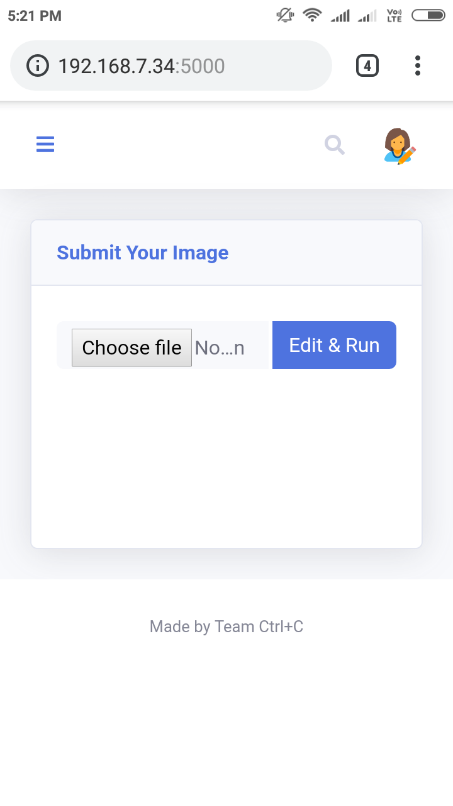
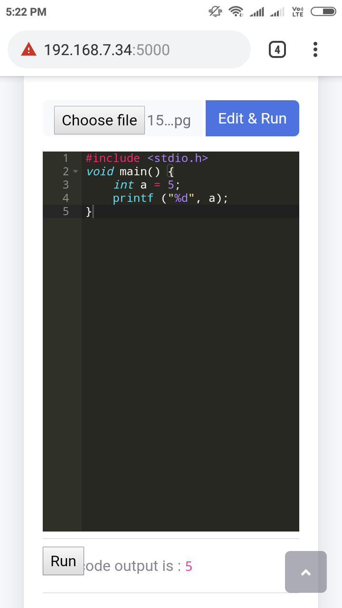
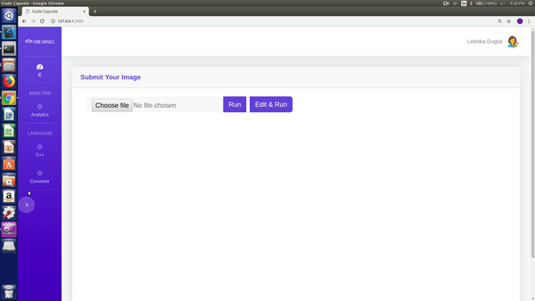
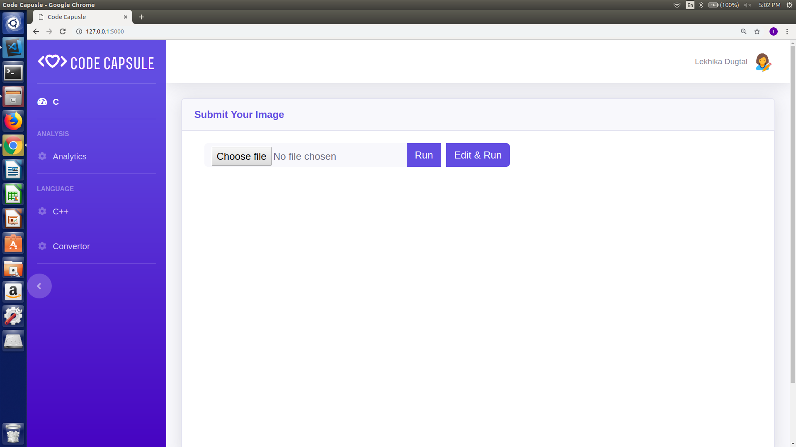
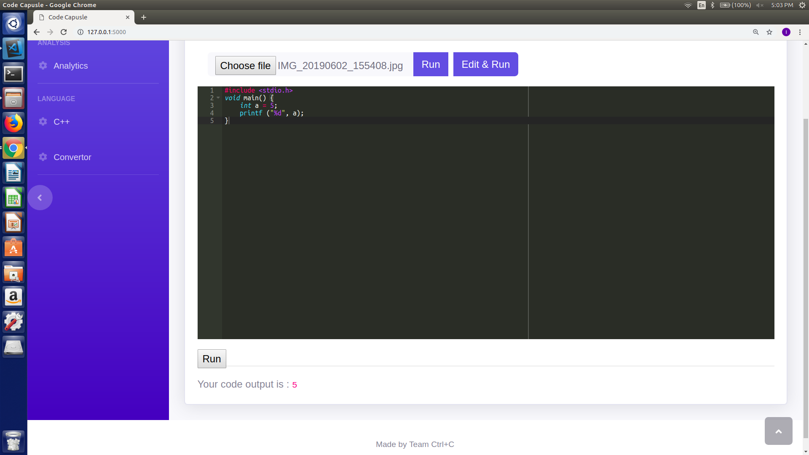

# Code Capsule

## Problem Statement
Currently, there are no services in the market which let you compile and execute your hand-written code directly.

## The Solution
* EASE AND SIMPLICITY  
Code Capsule is a coding tool built with the aim of simplifying your brainstorming-coding experience. As the name suggests Code Capsule compresses the various steps involved in coding from scratch, into a simple 3 click process - Scan. Edit. Run.
* CONVENIENCE  
Code capsule works on programming languages to bring your ideas from the chalk board into a reality.Owing to its highly versatile nature, Code Capsule finds applications in multiple domains, ranging from personal use at home, to institutional use by instructors or evaluators.

## TECH-STACKS USED
* BACKEND  
The backened server is implemented in FLASK. With its end points exposed as REST.
* GOOGLE CLOUD VISION  
GOOGLE CLOUD VISION supports optical character recognisation and extracts text.
* FRONTEND  
Frontend is implemented in jquery. and bootstrap

### Mobile Interface
In Mobile Interface, Code Capsule allows you to directly capture the image of your handwritten code and provides you the option of either running it as is or running it after editing, to provide the output.

### Desktop Interface
In Desktop Interface, the photo is uploaded directly for code recognition. As in the mobile interface, after selection of one of the two available options, the code is compiled and executed.

## FUTURE COURSE
* Provide option for Bulk Evaluation of codes.
* Paper-Pen test code evaluation for institutional use.
* Provision for direct Pseudo Code Evaluation.
* Improve text detection for better accuracy.
* Provide support for even more languages.
* Provide the accuracy growth of programmer over the time.